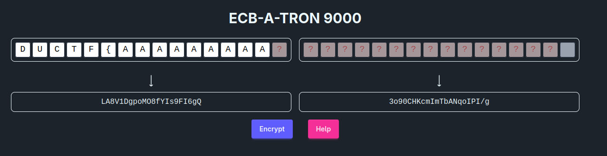

# Writeup

This challenge is a demonstration of a well known attack against the Electronic
Code Book or ECB mode of operation. 

In cryptography, one of the most basic operations we can perform is encryption:
taking a piece of secret information and transforming it in such a way that only
someone who knows the key can reverse the transformation to recover the secret.

Nowadays, we have developed very strong encryption methods for this known as
block ciphers. These take input data of a fixed length (e.g 16 bytes) together
with a key, and produced encrypted output also of a fixed length.

Whilst strong, the downside to these methods is that they can only encrypt data
which matches the expected input size. In order to encrypt larger amounts of
data, we need to compose copies of these block ciphers together in ways that can
handle different input sizes. The different methods of composing block ciphers
are known as modes of operation. As a general rule of thumb, block ciphers
themselves are fairly secure, but their integration into modes of operations is
often where bugs can originate.

There are many different possible modes of operation, the most intuitive of
which is ECB. This mode addresses the problem of a block cipher only accepting
input of a fixed length by first padding the input to a multiple of the
blocksize, dividing the input into fixed size blocks, and applying the cipher to
each block individually.


When an attacker controls part of the input being fed into a cipher operating in
ECB mode, they can perform the following attack: First they introduce enough
input so that there is a block containing only one unknown character. 



After encrypting, they note the ciphertext associated with that one block. In our case it's
```
LA8V1DgpoMO8fYIs9FI6gQ
```

Next they gather ciphertexts for each possible value the last block could take.
For example in the above, they would try and encrypt `AAAAAAAAAAAAAAAA` then
`AAAAAAAAAAAAAAAB` and then `AAAAAAAAAAAAAAAC` etc. At some point, the
ciphertext will equal `LA8V1DgpoMO8fYIs9FI6gQ`. In our case, this occurs when we
encrypt `AAAAAAAAAAAAAAAC`

This means that the encryption of 
```
AAAAAAAAAAAAAAAD
```
and the encryption of
```
AAAAAAAAAAAAAAA?
```

where `?` denotes the unknown first character of the secret, both produce the
same ciphertext. Since the encryption is invertible, in order to produce the
same output the inputs must be the same. This means that the first character of
the secret must be `D`.

Finally, using our knowledge of the first character, we can repeat the above
process to brute force the other characters of the secret.

First we encrypt
```
AAAAAAAAAAAAAAD?
``` 

where ? is the unknown second secret character, and note the ciphertext. Then we
brute force `AAAAAAAAAAAAAADA`, `AAAAAAAAAAAAAADB`, `AAAAAAAAAAAAAADC` etc.
until we find a match. When we do, we will know the second character of the
secret.

Repeating the above for all the hidden characters reveals the secret
```
DONTUSEECBPLEASE
```


