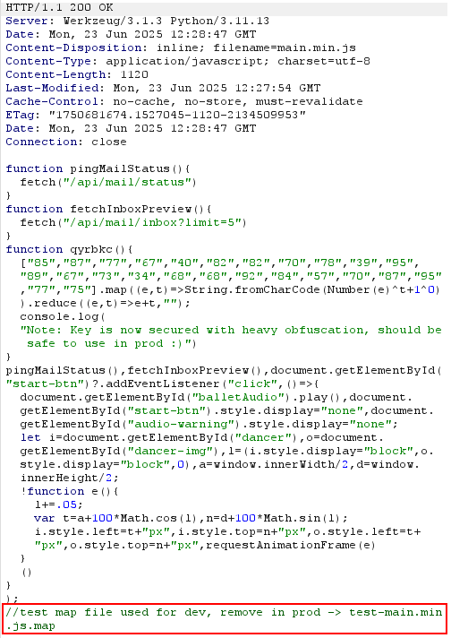
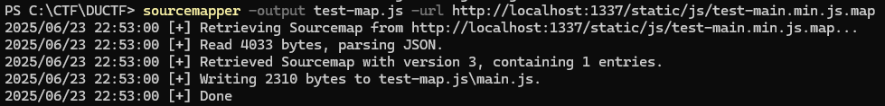
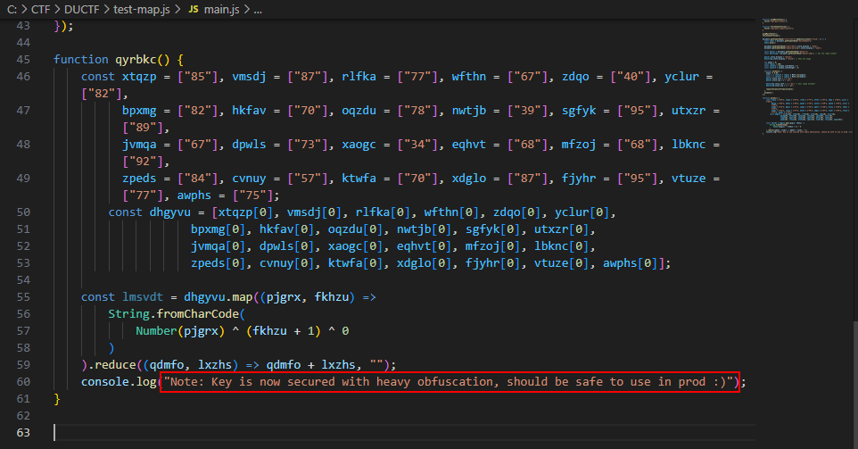
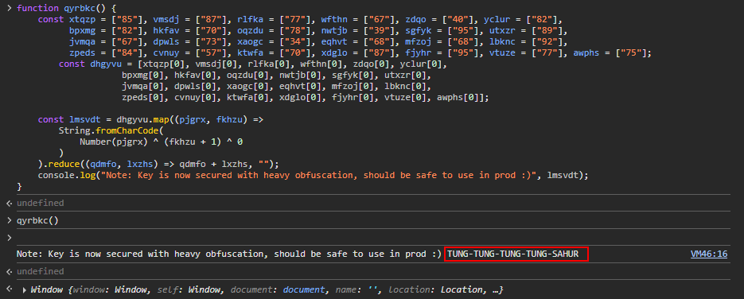
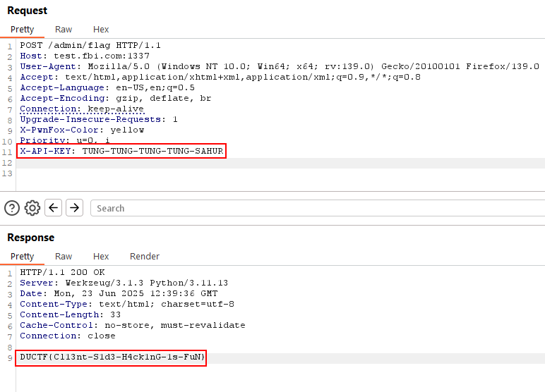

mini-me
============

1. Find `main.min.js` through the browser developer console and identify the `test map file` which is not supposed to be in production:

2. Use [Sourcemapper](https://github.com/denandz/sourcemapper) to reveal the contents of the map file:
```bash
sourcemapper -output test-unmapped.js -url http://localhost:1337/static/js/test-main.min.js.map
```

3. Identify a JavaScript function hardcoding an obfuscated secret in the sourcemapper output:

4. Modify the `console.log` line to print the `lmsvdt` variable to print the obfuscated string:
```javascript
function qyrbkc() { 
    const xtqzp = ["85"], vmsdj = ["87"], rlfka = ["77"], wfthn = ["67"], zdqo = ["40"], yclur = ["82"],
          bpxmg = ["82"], hkfav = ["70"], oqzdu = ["78"], nwtjb = ["39"], sgfyk = ["95"], utxzr = ["89"],
          jvmqa = ["67"], dpwls = ["73"], xaogc = ["34"], eqhvt = ["68"], mfzoj = ["68"], lbknc = ["92"],
          zpeds = ["84"], cvnuy = ["57"], ktwfa = ["70"], xdglo = ["87"], fjyhr = ["95"], vtuze = ["77"], awphs = ["75"];
        const dhgyvu = [xtqzp[0], vmsdj[0], rlfka[0], wfthn[0], zdqo[0], yclur[0], 
                    bpxmg[0], hkfav[0], oqzdu[0], nwtjb[0], sgfyk[0], utxzr[0], 
                    jvmqa[0], dpwls[0], xaogc[0], eqhvt[0], mfzoj[0], lbknc[0], 
                    zpeds[0], cvnuy[0], ktwfa[0], xdglo[0], fjyhr[0], vtuze[0], awphs[0]];

    const lmsvdt = dhgyvu.map((pjgrx, fkhzu) =>
        String.fromCharCode(
            Number(pjgrx) ^ (fkhzu + 1) ^ 0 
        )
    ).reduce((qdmfo, lxzhs) => qdmfo + lxzhs, ""); 
    console.log("Note: Key is now secured with heavy obfuscation, should be safe to use in prod :)", lmsvdt);
}
```
5. Paste this in the browser console and call the function to expose the key:


6. Using the `app.py` given with the challenge, identify the `/admin/flag.txt` endpoint:
```python
@app.route("/admin/flag", methods=["POST"])
def flag():
    key = request.headers.get("X-API-Key")
    if key == API_SECRET_KEY:
        return FLAG
    return "Unauthorized", 403
```

7. Use the identifed key as the `X-API-Key` in a post request to retrieve the flag!
